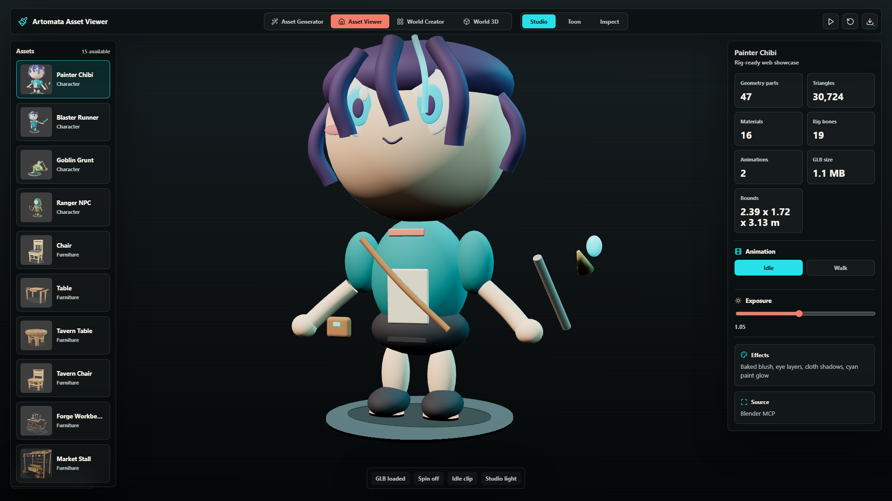
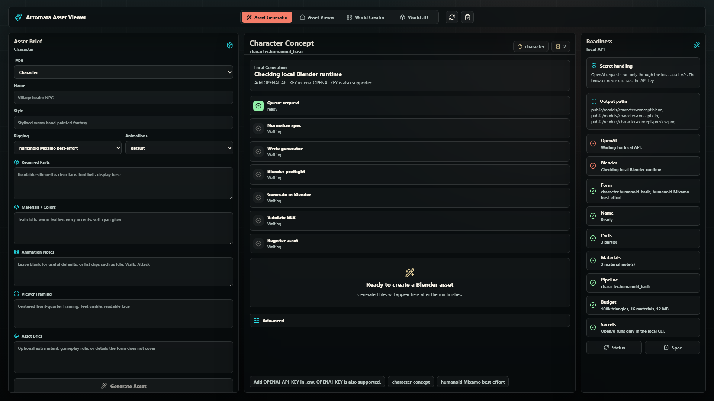
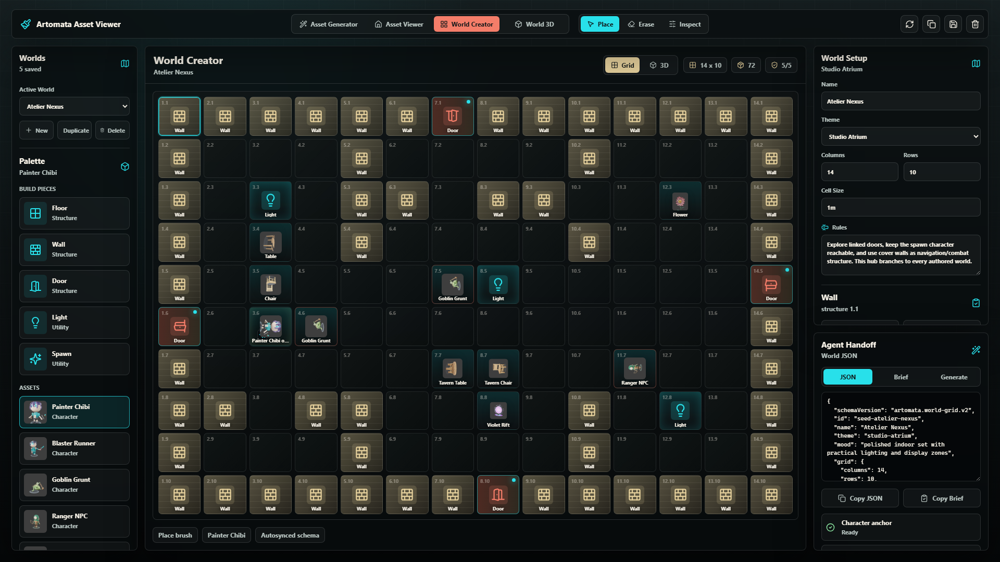
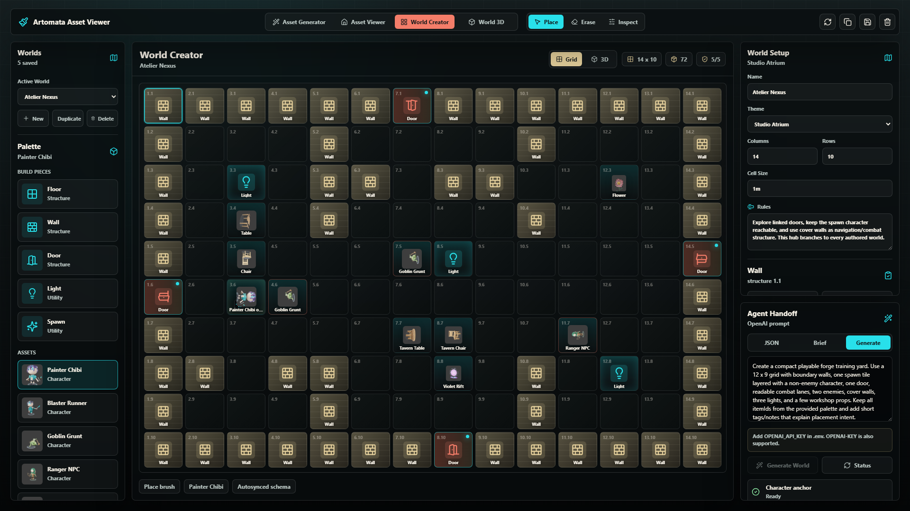
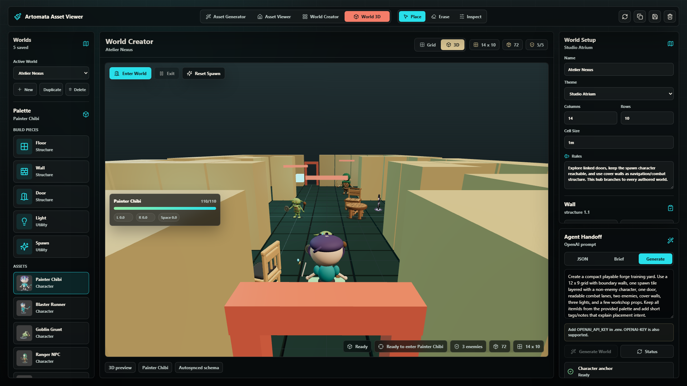

# OnTheSpectrum

**Prompt to asset to playable scene.**

OnTheSpectrum is a local-first game asset and world prototyping pipeline for teams that need to move from an idea to something inspectable, exportable, and playable. It turns structured asset briefs into Blender-backed outputs, registers them in a Three.js viewer, and lets designers assemble those assets into saved worlds with JSON and brief handoff built in.

The current app surface is branded **OnTheSpectrum Asset Viewer**. OnTheSpectrum is the full product workflow around it: asset generation, asset inspection, world creation, 3D preview, and demo capture.



## Why Game Teams Use It

- Go from prompt to game-ready asset package without handing API keys to the browser.
- Keep Blender as the source of truth while still shipping web-ready GLB previews.
- Inspect geometry, materials, animations, bounds, source files, and exports in one place.
- Turn registered assets into reusable worlds with saved maps, linked doors, combat roles, and agent handoff.
- Prove the pipeline with browser QA across the standalone asset viewer and the 3D world preview.

## Product Tour

### 1. Brief The Asset

Start with a production-shaped brief: asset family, style, rigging, animation intent, required parts, materials, and viewer framing. The local API normalizes the brief, runs generation steps, validates budgets, and registers successful outputs.



### 2. Inspect The Result

The viewer loads every registered GLB into a Three.js scene with studio/toon/inspect lighting, animation controls, export links, source metadata, and geometry facts. The included library currently ships with **15 GLB models**, **15 Blender source files**, and **15 preview renders**.


### 3. Build Worlds From The Asset Library

World Creator turns the same assets into a design palette. Teams can place walls, doors, lights, spawn points, characters, props, and VFX, then save, duplicate, switch, import, or export worlds without leaving the editor.



### 4. Hand Off To Agents And Tools

Agent Handoff exposes both machine-readable JSON and human-readable briefs. The Generate tab lets a team draft a new playable world from a prompt while preserving current palette IDs and world rules.



### 5. Play The Scene In 3D

The World 3D view loads the authored map into a playable preview with registered assets, navigation, combat state, linked doors, and a HUD. It is a fast way to test whether a layout actually reads in motion.



## What Ships

- **Asset Generator**: structured briefs for characters, furniture, plants, props, and VFX.
- **Local asset API**: OpenAI-powered spec normalization and Blender pipeline orchestration.
- **Blender source outputs**: `.blend` files remain the editable source of truth.
- **Web exports**: GLB, preview PNG, metadata JSON, and optional Mixamo FBX/OBJ exports for humanoids.
- **Asset Viewer**: Three.js inspection, lighting modes, animation controls, downloads, and screenshots.
- **World Creator**: saved world library, grid editing, placement metadata, imports, exports, and handoff panels.
- **World 3D**: browser-based playable preview with authored assets and traversal/combat checks.
- **Remotion demo sidecar**: a 2-minute application demo workflow in `video-demo/`.

## Quick Start

```powershell
npm install
npm run dev
```

Open `http://127.0.0.1:5173`.

`npm run dev` starts both services:

- Vite app: `http://127.0.0.1:5173`
- Local asset API: `http://127.0.0.1:5174`

You can explore the included viewer and worlds without an API key. Asset and world generation require local environment setup.

## Environment

Copy `.env.example` to `.env` and set:

```env
OPENAI_API_KEY=
OPENAI_MODEL=gpt-5.5
OPENAI_REASONING_EFFORT=low
```

OpenAI is used only by local CLI/API tooling. The Vite browser app never receives the API key.

For generation, start Blender with the MCP add-on listening on `127.0.0.1:9876`, or configure `BLENDER_PATH` so the pipeline can run Blender in the background.

## Asset Pipeline

The pipeline converts a brief into a durable asset package:

1. Normalize the brief into an asset spec.
2. Run Blender preflight.
3. Generate the source scene in Blender.
4. Save `.blend`, export `.glb`, render preview `.png`, and write metadata.
5. Register the asset in the React/Vite viewer.
6. Validate web budgets and browser behavior.

Stable output paths:

```text
public/models/<slug>.blend
public/models/<slug>.glb
public/models/<slug>.metadata.json
public/renders/<slug>-preview.png
public/exports/<slug>/<slug>-mixamo.fbx
public/exports/<slug>/<slug>-mixamo-obj.zip
```

See [docs/asset-pipeline.md](docs/asset-pipeline.md) for the detailed asset workflow.

## Useful Commands

```powershell
npm run dev          # App + local asset API
npm run dev:vite     # Vite only
npm run build        # Production build
npm run qa:viewer    # Browser QA for asset viewer
npm run qa:world     # Browser QA for World 3D
npm run asset:agent  # Generate an asset from a brief
npm run asset:exports
```

## Verification

Before sharing a build, run:

```powershell
npm run build
npm run qa:viewer
npm run qa:world
```

The QA scripts verify canvas rendering, asset loading, responsive behavior, animation controls, world navigation, and 3D preview readiness.

## Video Demo

The `video-demo/` sidecar renders a 2-minute guided demo with captured app screens and optional voiceover.

```powershell
cd video-demo
npm install
npm run capture
npm run render
```

See [video-demo/README.md](video-demo/README.md) for the full Remotion workflow.
